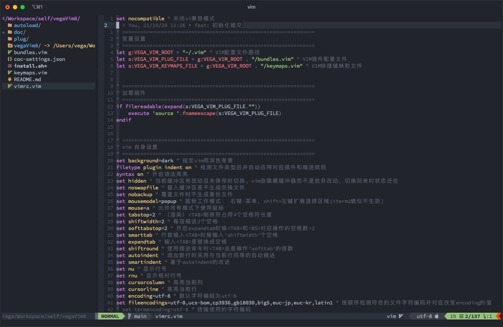
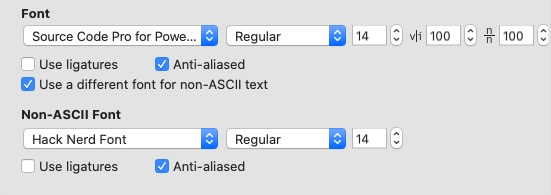
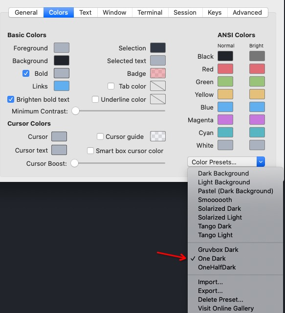

# vim8 前端配置

vega 自用 vim 配置折腾，比较适用于前端开发, for vim8.2+



neovim 版本请移步[https://github.com/vegawong/vegaVIM](https://github.com/vegawong/vegaVIM)

## Required

- nodejs

  lts 版本。

  ```
  $ npm i -g neovim
  ```

- typescript

  ```bash
  $ npm i -g typescript
  ```

- python2

  ```
  $ brew intall python@2
  $ sudo pip2 install pynvim
  ```

- python3

  ```
  $ brew install python3
  $ sudo pip3 install --upgrade pynvim
  ```

- rg

  ```
  $ brew install ripgrep
  ```

- powerline-fonts
  [https://github.com/powerline/fonts](https://github.com/powerline/fonts)

- nerd-fonts
  [https://github.com/ryanoasis/nerd-fonts#option-4-homebrew-fonts](https://github.com/ryanoasis/nerd-fonts#option-4-homebrew-fonts)

## Install

1. 安装 vim8.2

[https://github.com/vim/vim#installation](https://github.com/vim/vim#installation)

2. 安装配置

```
$ git clone https://github.com/vegawong/vegaVim8 && cd vegaVim8 && ./install.sh

```

3. 搭配终端

   这里距离 mac 下的 iterm2，其他平台的终端软件请对应调整字体和配色

   - 字体字号：

     
      
   - 颜色主题, 保持与vim相同，这样在终端开启vim时才不会有突兀感（vim终端模式开启透明背景）

     

## Keymap

| 模式 | 快捷键   | 说明                                                              |
| ---- | -------- | ----------------------------------------------------------------- |
| I    | `<C-b>`  | 光标后退                                                          |
| I    | `<C-f>`  | 光标前进                                                          |
| N, V | `YY`     | 复制当前内容到系统粘贴板                                          |
| N    | `,p`     | 粘贴系统粘贴板的内容到当前光标                                    |
| N, V | `XX`     | 切切当前内容到系统粘贴板                                          |
| N    | `dd`     | 替换原生 dd，当时不占用寄存器（不能粘贴）                         |
| N    | `ci`     | 替换原生 ci，不占用寄存器（不能粘贴）                             |
| N    | `[c`     | 跳转到上一个警告                                                  |
| N    | `]c`     | 跳转到下一个警告                                                  |
| N    | `gd`     | 跳转到定义                                                        |
| N    | `gy`     | 跳转到类型定义                                                    |
| N    | `gi`     | 跳转到实现的地方                                                  |
| N    | `gr`     | 跳转到引用的地方                                                  |
| N    | `,rn`    | 变量重命名                                                        |
| N    | `K`      | 展示文档说明                                                      |
| N    | `,f`     | 快速打开文件，速记 files                                          |
| N    | `,fg`    | grep 全局搜索，速记 find grep                                     |
| N    | `,b`     | buffer 列表， 速记 buffers                                        |
| N    | `,<C-f>` | 代码格式化                                                        |
| N    | `,fl`    | 切换显示文件管理器, 速记 file list`                               |
| N    | `,fll`   | 快速定位当前 buffer 的文件管理器所在位置, 速记 file list location |

### 文件管理器快捷键

| 快捷键 | 说明                  |
| ------ | --------------------- |
| `<CR>` | 展开收起目录/打开文件 |
| `ad`   | 新增目录              |
| `af`   | 新增文件              |
| `rn`   | 重命名                |
| `dd`   | 删除                  |
| `mv`   | 剪切                  |
| `cp`   | 复制                  |
| `p`    | 粘贴                  |

## FAQ

1. 升级 vim8.2 之后显示很多`^[[^[[`这样的乱码？

> 把 vimrc 里面的 termguicolors 判断里面的 t_8f 和 t_8b 注释掉

```
" if has("termguicolors")
"     " fix bug for vim
"     set t_8f=^[[38;2;%lu;%lu;%lum
"     set t_8b=^[[48;2;%lu;%lu;%lum

"     " 给终端开启truecolor
"     set termguicolors
" endif
```
